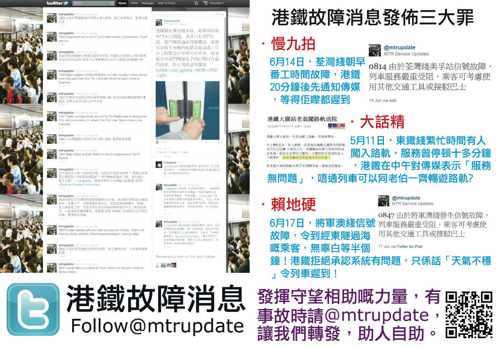

為更有效推廣港鐵故障消息服務，我們印製了悉數單張於「7．1大遊行」派發。

單將的設計概念，以「將Timeline拿上手」為主，讓大部分未接觸過Twitter 的使用者，可以即時感受到Twitter 時間軸（Timeline）的便利。接過單張的市民可以於時間軸上見到事故消息外，也會見到我們早前為「非稍有阻延事故」引入的「詳盡資訊」，讓他們可以清楚事故進展，和計劃接下來的行程。在時間軸的延伸欄，我們都特意選擇刊出早前發出提醒乘客避免「被列車越載」的Tips，介紹了我們進一步的服務、與乘客對話的過程。

單張的另一邊，簡明扼要地以過去鐵路事故為例，向乘客解釋我們的成立目的、呼籲乘客「發揮守望相助嘅力量，有事故時請[@mtrupdate][1]，讓我們轉發，助人自助。」，並讓他們用智能手機掃瞄QR-code到港鐵故障消息的Twitter 網站。

我們將於下午二時半開始，於灣仔消防局對面，近鵝頸橋的「尖碼之聲」攤位派發單張。

 [1]: http://twitter.com/#!/mtrupdate

